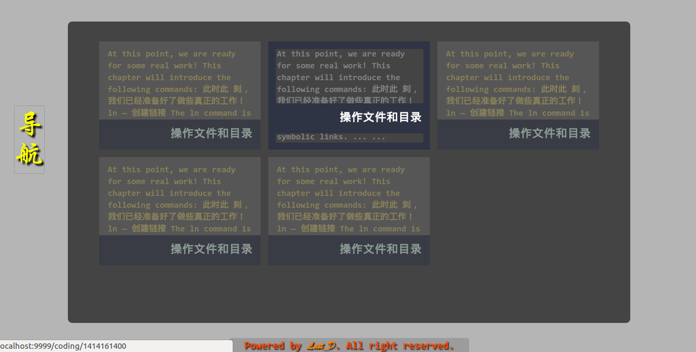
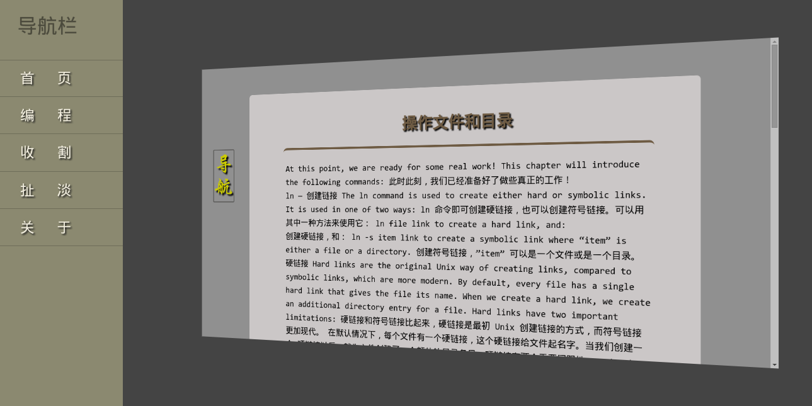
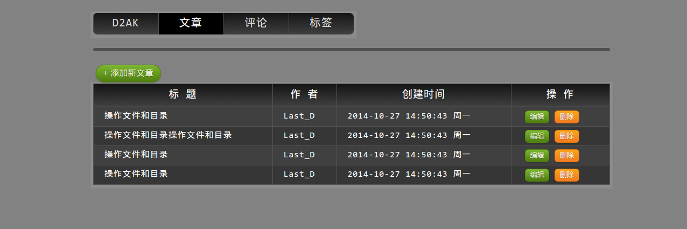

#Errors should never pass silently.

学习 Python 也半年有余了，但感觉学的一塌糊涂。刚开始的时候由于非常浮躁，【xxx: “Python 太简单了”，xxx: “当天下午入门，第二天就接手公司项目” ...】 我特么难道是傻X? 直接上手 Python3，看了几天 《Python 核心编程》，又看了几天 Django book ... 又找寻什么框架上手更简单，期间了解了一下 HTML, CSS, JS ... 开始用 Tornado 也仅限使用 RequestHandler 类搞几个简单页面。
真正学到点东西是看[廖老师的实战](http://www.liaoxuefeng.com/wiki/001374738125095c955c1e6d8bb493182103fac9270762a000/001397616003925a3d157284cd24bc0952d6c4a7c9d8c55000)以及某位大神的一份学习[笔记](https://github.com/qyuhen/book)，第一遍看得一知半解，然后暑假做了几天服务员就这么废了，回到学校又重新学习了下，期间也了解了标准库里的一些模块，做了点[笔记(差不多是一个待学列表加平时收刮的一些资源)](https://github.com/Damnever/Note)，才渐渐靠近正轨。廖老师实战里的 Web 框架也有些地方看得一知半解 ... Google 在手，天下我有:
- [RFC 2616 (HTTP协议)](http://www.faqs.org/rfcs/rfc2616.html)
- [RFC 2109 (Cookie)](https://www.ietf.org/rfc/rfc2109.txt)
- [Web Python (CGI&WSGI)](http://webpython.codepoint.net/) & [译文](http://www.xefan.com/archives/84004.html)
-  [PEP333 (Python Web Server Gateway Interface v1.0)](http://www.python.org/dev/peps/pep-0333) & [译文](http://www.cnblogs.com/laozhbook/p/python_pep_333.html)
- [Serving Static Content With WSGI](http://pwp.stevecassidy.net/wsgi/static.html)
- [ PEP 249 (Python Database API Specification v2.0)](http://legacy.python.org/dev/peps/pep-0249/) & [不完全译文](http://blog.csdn.net/dajianshi/article/details/7482201)

我就寻思着自己也倒腾一个自己理解的轻量级框架，既然廖老师的路由用的装饰器，看来我就不能这么搞了，不然我也就如同 The walking dead 了。好吧！用了我理解中的元类，然后这货长得有点像 Tornado 了，但是完全没有异步特性 ...

同时也在慢慢学习 Git 和 VIM。另外四级才过，所以那些注释就忽略好了 ...

---

> **已完成**：
- 支持 cookie 以及基于 session(Cookie形式) 的权限拦截器
- 基于 WSGI 的微框架 LTok (lightweight is ok) 0.1 版
- 为 Jinja2 加入一些自定义的过滤器
- 些许前端页面
- 使用 Markdown2 因为他可以不用安装，而且应用可能部署在 SAE 上面(穷)
- ORM **"引用"**完成
- MySQL 脚本

> **待完成**：
- 文档
- 更详细的 Log 信息输出(直戳硬伤-En)
- 用 Json 传数据 ?
- 后台管理
- 评论
- N++ >>> Done！I'm walking with Jesus ......

---

##几行代码：
```
from LTok.web import Page, App
import os

class Index(Page):
    def get(self):
    	# 也可以用 self.render(template_name, **kw) 缺省使用Jinja2
        return self.show('Hello, world!')

app = App(
	# 可以用正则表达式
    [('/(index)?', Index)],
    # templates 和 static 文件夹都默认为当前文件夹下，亦可自行设置
    template_path = os.path.join(os.path.dirname(__file__), 'templates'),
    static_path = os.path.join(os.path.dirname(__file__), 'static')
)

if __name__ == '__main__':
    app.run()
```

---

##传说中的效果（索命翔王--前端）

主页

文章

后台